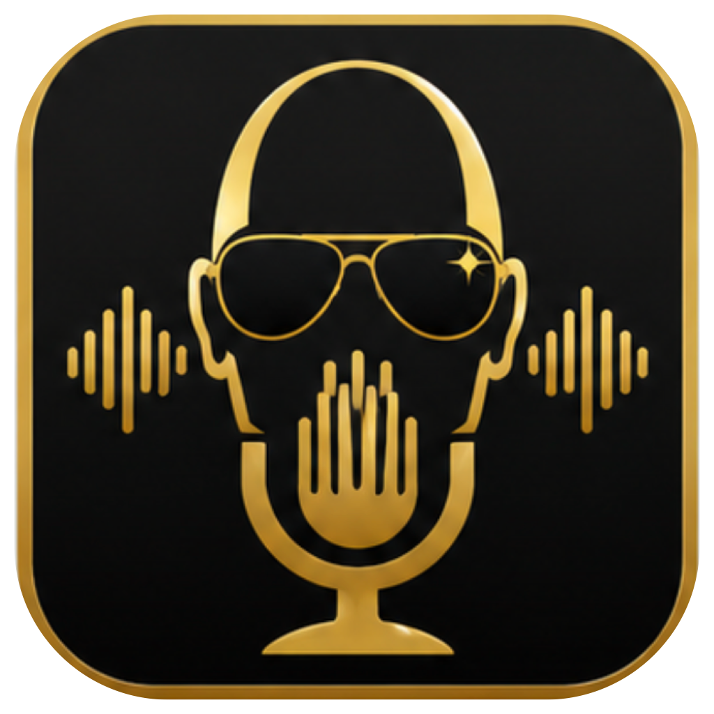

<p align="center">
  
</p>

<h1 align="center">andrew dictate</h1>

<p align="center"><strong>escape the keyboard.</strong></p>

dictation and meeting transcripts for macOS. free, open source, and the speech models run on your mac, so nothing you say goes anywhere.

i built it because i wanted the wispr flow experience without the account, the subscription, or my voice going to a server. i use it all day. it's alpha and i'll tell you where it's rough.

## what it does

**hold `fn`, talk, let go.** the text lands where your cursor is.

the model is on your mac, so there's no server to wait for. you let go, it pastes. a dictionary fixes the words it keeps mishearing ("jason" → `json`), and `fix a word…` in the menu bar adds one from the last thing you said. spoken punctuation, emails, and numbers get written the way you'd type them. it never rewrites your words. if you want that, there's an optional polish pass on apple's on-device model, off by default.

**record a meeting** from the menu bar. your mic is you, the app you pick is them. when you stop, you get one markdown file with speakers split out. hindi or hinglish on their side comes out as english. no audio is kept. you start it and stop it yourself, it doesn't watch what's using your mic.

## install

```sh
brew install --cask jassuwu/tap/andrew-dictate
xattr -dr com.apple.quarantine "/Applications/Andrew Dictate.app"
```

or grab the dmg from [releases](https://github.com/jassuwu/andrew-dictate/releases).

the `xattr` line is there because the build is unsigned. i haven't paid apple the $99 for a developer account yet, so macOS quarantines it. right-click → open works too.

first launch asks which jobs you want. dictation is a ~460 mb download, meetings are ~2.9 gb. tick one or both.

## where your words go

nowhere. the app has two things that touch the network, and you trigger both.

- downloading a speech model, the first time you set up a job.
- `check for updates` in the about window, which asks github for the latest tag.

there's no account, no analytics, and no crash reporting. audio is never written to disk, except during a meeting, where a temp file holds it until the transcript is saved and then it's deleted. dictations are kept in a local history you can switch off or wipe.

it's about 17k lines of swift. read it.

## limits

- apple silicon, macOS 26 or newer.
- dictation is english by default. a multilingual model is one click away in settings.
- meetings only write english. if you read hindi and want hindi, that's not here yet.
- unsigned builds mean no auto-update. `check for updates` tells you, you install.

## next

signed builds with auto-update. whisper as a dictation option, for languages parakeet doesn't do.

not coming: accounts, cloud, sync, a paid tier, telemetry, windows, linux, ios.

## credits

[FluidAudio](https://github.com/FluidInference/FluidAudio) (apache-2.0) · [parakeet](https://huggingface.co/nvidia/parakeet-tdt-0.6b-v2) (cc-by-4.0) · [WhisperKit](https://github.com/argmaxinc/WhisperKit) (mit) · [whisper](https://github.com/openai/whisper) (mit) · [mit](LICENSE) · made by [jass](https://jass.gg)
