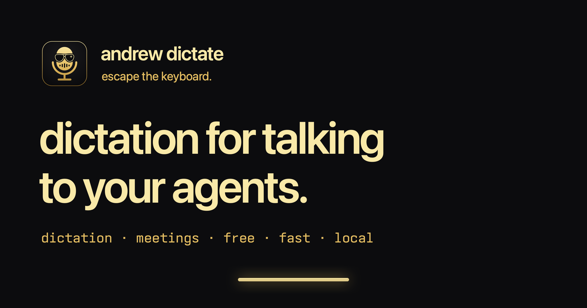
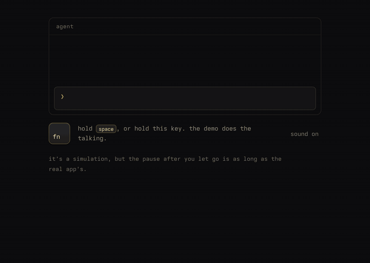

<p align="center">
  
</p>

**andrew dictate** · alpha · escape the keyboard.

dictation for talking to your agents.<br>
meeting transcripts your agents can read.<br>
free. fast. local.

i made this to be fast and free. speed is the part that doesn't change.

the words and the formatting aren't always right. [they get better over time](https://dictate.jass.gg/changelog), and i fix mistakes as i see them.

the speech models are parakeet and whisper. this app puts them together and stays out of your way.

<p align="center">
  
</p>

that's the demo from [dictate.jass.gg](https://dictate.jass.gg), filmed. you can hold the key yourself there.

## install

```sh
brew install --cask jassuwu/tap/andrew-dictate
```

apple silicon, macOS 26.

i'm broke, so i didn't pay apple $99 to sign this. run this once, and never again:

```sh
xattr -dr com.apple.quarantine "/Applications/Andrew Dictate.app"
open "/Applications/Andrew Dictate.app"
```

the second line opens it. there's no dock icon. a setup window comes up, and after that it lives as the gold badge in your menu bar. setup asks which jobs you want. dictation (~460 mb) is ticked, and meeting recording (~2.9 gb) is there to tick.

no terminal? open the app, let macOS refuse, then click `open anyway` in system settings › privacy & security. that button is only there for about an hour. there's a dmg in [releases](https://github.com/jassuwu/andrew-dictate/releases) too.

## update

```sh
brew upgrade --cask jassuwu/tap/andrew-dictate
```

you don't need the `xattr` line again. the menu says when there's a new version, and a click on that line runs the upgrade for you.

to know there's a new version, the app asks dictate.jass.gg once a day and sends only the version it's running. a switch in settings › general stops it.

## what it does

**dictate.** hold `fn`, talk, let go. the text lands where your cursor is, in any app. the model runs on your mac, so there's no wait for a server, and it works offline. a dictionary fixes a mishearing that keeps coming back. double-tap `fn` to talk hands-free. `esc` throws it away. if your keyboard eats `fn`, pick another key in settings. english, or 25 languages.

**record a meeting.** press record in the menu bar. your mic is you, and whatever the mac plays is them. press stop and you have one markdown file with the speakers split out. point your agent at the folder. when a call starts, the app asks if you want it recorded. it never starts by itself. settings can run one script of yours after each meeting is saved, with the path to the file. written in english by default, from any language whisper knows.

if you want something that this app does not do, fork it. the licence is MIT.

## credits

[FluidAudio](https://github.com/FluidInference/FluidAudio) (apache-2.0) · [parakeet](https://huggingface.co/nvidia/parakeet-tdt-0.6b-v2) (cc-by-4.0) · [WhisperKit](https://github.com/argmaxinc/WhisperKit) (mit) · [whisper](https://github.com/openai/whisper) (mit) · [silero vad](https://github.com/snakers4/silero-vad) (mit) · [mit](LICENSE) · made by [jass](https://jass.gg)
