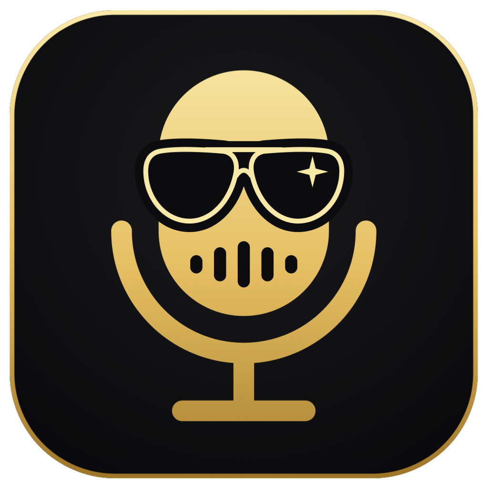

<p align="center">
  
</p>

<h1 align="center">andrew dictate</h1>

<p align="center"><strong>escape the keyboard.</strong></p>

dictation and meeting transcripts for macOS. free, open source, and the speech models run on your mac, so nothing you say goes anywhere.

i built it because i wanted the wispr flow experience without the account, the subscription, or my voice going to a server. i use it all day. it's alpha and i'll tell you where it's rough.

## what it does

**hold `fn`, talk, let go.** the text lands where your cursor is.

on a keyboard that isn't apple's, `fn` often never reaches the mac — settings › dictation has a key picker with right ⌥ and five others.

the model is on your mac, so there's no server to wait for. you let go, it pastes. a dictionary fixes the words it keeps mishearing ("jason" → `json`), and `fix a word…` in the menu bar adds one from the last thing you said. spoken punctuation, emails, and numbers get written the way you'd type them. it never rewrites your words. double-tap `fn` to lock it and talk hands-free — one more tap ends it. `esc` throws the dictation away mid-sentence; nothing pastes, nothing is kept.

**record a meeting** from the menu bar. your mic is you, the app you pick is them. when you stop, you get one markdown file with speakers split out. hindi or hinglish on their side comes out as english. no audio is kept. you start it and stop it yourself, it doesn't watch what's using your mic.

## install

```sh
brew install --cask jassuwu/tap/andrew-dictate
xattr -dr com.apple.quarantine "/Applications/Andrew Dictate.app"
open "/Applications/Andrew Dictate.app"
```

or grab the dmg from [releases](https://github.com/jassuwu/andrew-dictate/releases). quit the running copy before you open a new one — two copies share one archive, and one meeting.

the `xattr` line is there because the build is unsigned. i haven't paid apple the $99 for a developer account yet, so macOS quarantines it. no terminal? open the app, let macOS refuse, then go to system settings › privacy & security and click `open anyway` — that button only shows up for about an hour after macOS blocks it.

the last line opens it. there's no dock icon — a setup window comes up, and after that it lives as the gold badge in your menu bar. setup asks which jobs you want: dictation (~460 mb) is ticked; meeting recording (~2.9 gb) is there to tick if you want it.

## update

```sh
brew upgrade --cask jassuwu/tap/andrew-dictate
```

that's it — you don't run the `xattr` line again. every release is signed with the same key, so homebrew carries your approval to the new version and your microphone and accessibility grants survive.

brew swaps the app on disk, it can't restart it for you: quit andrew from the menu bar and open it again to be running the new one. the about window notices, and offers you the restart.

## where your words go

nowhere. the speech models run on your mac, so nothing you say leaves it. the app does go online in three places, and this is all of them.

- downloading a speech model, the first time you set up a job. you click for it.
- `check for updates` in the about window, which asks github for the latest tag. you click for that too.
- once a day, the app asks dictate.jass.gg for the newest version. the request is `dictate.jass.gg/api/latest?version=0.9.4` with your version in it, and that's all. no id, no account, nothing about your mac. vercel hosts the site, so it sees your ip address like any web host would. if there's something newer, a line in the menu says so. it never asks while you're dictating or recording a meeting, and a switch in settings › general stops it.

that last one is new. i used to say the app only went online when you clicked something. but fixes weren't reaching people, so now it asks once a day, and you can turn it off.

there's no account, no analytics, and no crash reporting. audio is never written to disk, except during a meeting, where a temp file holds it until the transcript is saved and then it's deleted. dictations are kept in a local history you can switch off or wipe.

it's about 22k lines of swift. read it.

## limits

- apple silicon, macOS 26 or newer.
- dictation is english by default. a multilingual model is one click away in settings.
- meetings only write english. if you read hindi and want hindi, that's not here yet.
- one dictation stops at five minutes. it keeps what it heard and pastes it — it just stops listening.
- unsigned builds mean no auto-update. `check for updates` in the about window tells you when there's one; `brew upgrade` installs it, no `xattr` line needed.

## next

signed builds with auto-update. whisper as a dictation option, for languages parakeet doesn't do.

not coming: accounts, cloud, sync, a paid tier, telemetry, windows, linux, ios.

## credits

[FluidAudio](https://github.com/FluidInference/FluidAudio) (apache-2.0) · [parakeet](https://huggingface.co/nvidia/parakeet-tdt-0.6b-v2) (cc-by-4.0) · [WhisperKit](https://github.com/argmaxinc/WhisperKit) (mit) · [whisper](https://github.com/openai/whisper) (mit) · [mit](LICENSE) · [the film](https://github.com/jassuwu/andrew-dictate/releases/latest/download/andrew-dictate-launch.mp4) · made by [jass](https://jass.gg)
