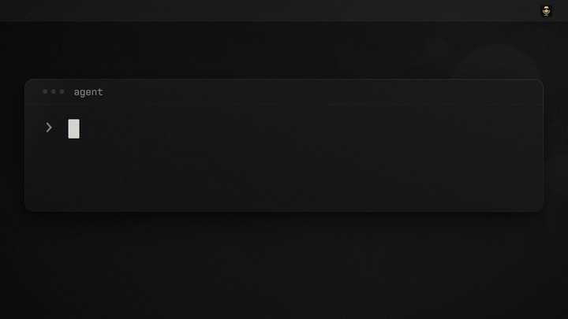
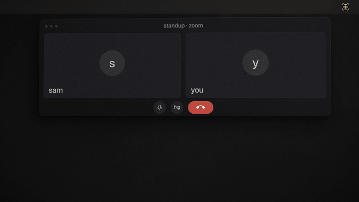

<p align="center">
  
</p>

a mac app. it's alpha. the words and the formatting aren't always right, and [they get better over time](https://dictate.jass.gg/changelog).

## dictate

hold `fn`, talk, let go. the text lands where your cursor is, in any app. double-tap `fn` to talk hands-free, and `esc` throws it away. a dictionary fixes a word it keeps mishearing. if your keyboard eats `fn`, pick another key in settings. english, or 25 languages.

<p align="center">
  
</p>

## meetings

press record in the menu bar, or say yes when the app asks at the start of a call. it never starts by itself. your mic is you, and whatever the mac plays is them. press stop and you get one markdown file with the speakers split out, in english by default. point your agent at the folder. settings can run a script of yours after each meeting is saved.

<p align="center">
  
</p>

## install

```sh
brew install --cask jassuwu/tap/andrew-dictate
```

apple silicon, macOS 26. i'm broke, so i didn't pay apple $99 to sign this. run this once:

```sh
xattr -dr com.apple.quarantine "/Applications/Andrew Dictate.app"
open "/Applications/Andrew Dictate.app"
```

there's no dock icon. it lives in the menu bar as the gold badge. setup asks which jobs you want: dictation (~460 mb), and meetings (~2.9 gb) if you tick it.

no terminal? open the app, let macOS refuse, then click `open anyway` in system settings › privacy & security within the hour. there's a dmg in [releases](https://github.com/jassuwu/andrew-dictate/releases) too.

## update

the menu says when there's a new version, and a click updates it. or:

```sh
brew upgrade --cask jassuwu/tap/andrew-dictate
```

to know, the app sends its version to dictate.jass.gg once a day, and nothing else. settings › general turns that off.

## credits

[FluidAudio](https://github.com/FluidInference/FluidAudio) apache-2.0 · [parakeet](https://huggingface.co/nvidia/parakeet-tdt-0.6b-v2) cc-by-4.0 · [WhisperKit](https://github.com/argmaxinc/WhisperKit) mit · [whisper](https://github.com/openai/whisper) mit · [whistle](https://huggingface.co/Cactus-Compute/whistle) apache-2.0 · [silero vad](https://github.com/snakers4/silero-vad) mit

[mit](https://github.com/jassuwu/andrew-dictate/blob/main/LICENSE), so fork it if you want it different. made by [jass](https://jass.gg).
